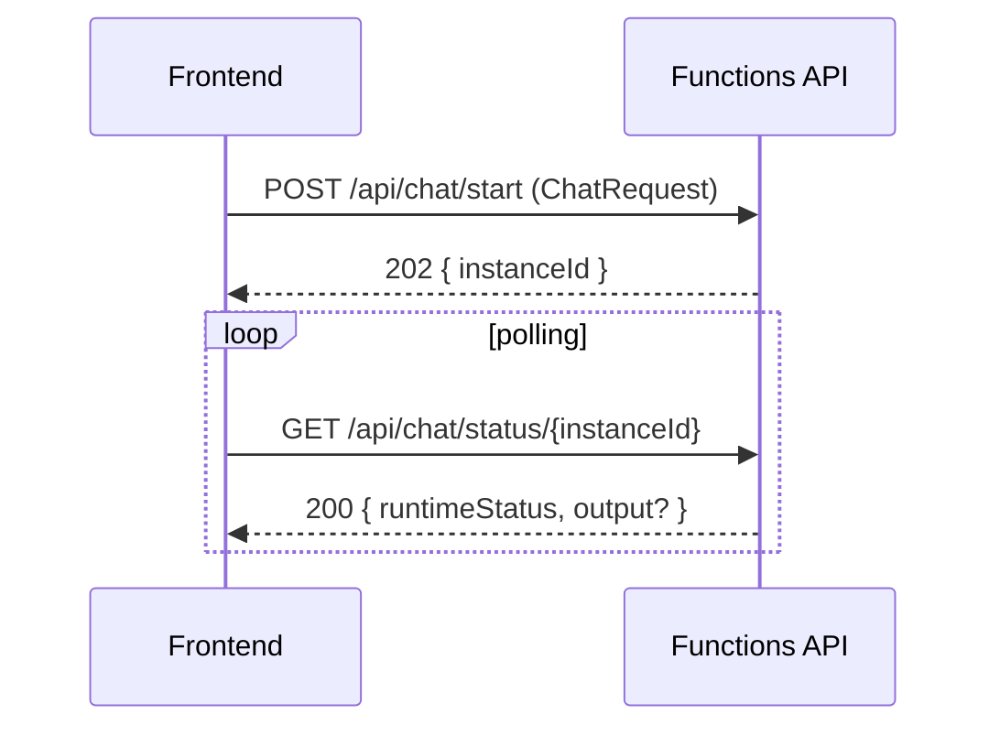

# API 仕様

REST API の仕様。**正準定義**は [openapi.yaml](./api/openapi.yaml)（OpenAPI 3.0）。本ドキュメントは要約と利用方法。

## 1. エンドポイント概要

| メソッド | パス | 概要 |
| --- | --- | --- |
| `POST` | `/api/chat/start` | チャット開始（オーケストレーション起動） |
| `GET` | `/api/chat/status/{instanceId}` | チャットステータス取得（ポーリング） |

ベース URL：
- ローカル: `http://localhost:7071`
- Azure: `https://<function-app-name>.azurewebsites.net`（フロント `NEXT_PUBLIC_API_BASE_URL`）

## 2. 利用フロー



## 3. リクエスト / レスポンス例

### 3.1 開始

```http
POST /api/chat/start
Content-Type: application/json

{
  "sessionId": "s-abc-001",
  "userId": "u-001",
  "message": "地震の備えを教えて",
  "agentMode": "auto"
}
```

```json
HTTP/1.1 202 Accepted
{
  "instanceId": "5f2c...e1",
  "statusQueryGetUri": "https://.../api/chat/status/5f2c...e1"
}
```

### 3.2 ステータス（完了後）

```json
HTTP/1.1 200 OK
{
  "runtimeStatus": "Completed",
  "output": {
    "answer": "地震への備えとしては...",
    "agent": "disaster-learning",
    "citations": [
      { "title": "...", "source": "...", "url": "...", "score": 0.82 }
    ],
    "metadata": {
      "intent": "general",
      "latencyMs": 4310,
      "tokenUsage": { "input": 412, "output": 230 }
    }
  },
  "createdTime": "2025-01-01T00:00:00Z",
  "lastUpdatedTime": "2025-01-01T00:00:05Z"
}
```

## 4. エラー

`runtimeStatus` 完了前 / 入力不正の場合は標準 4xx/5xx を返す：

| HTTP | code | 説明 |
| --- | --- | --- |
| 400 | `INVALID_REQUEST` | 必須項目欠落・型違反・JSON パース不可 |
| 500 | `INTERNAL_ERROR` | 想定外のエラー |
| 500 | `UPSTREAM_ERROR` | 上流（OpenAI / Search / Cosmos）の継続的失敗 |

レスポンス例：
```json
{ "error": "agentMode is required", "code": "INVALID_REQUEST" }
```

## 5. ポーリング推奨

- 初回 1 秒、以降 1.5〜2 秒間隔で指数バックオフ（最大 60 秒）
- `Completed` / `Failed` / `Terminated` で停止
- `AbortController` などで途中キャンセル可能に

## 6. CORS

ローカル設定では `http://localhost:3000` のみ許可（`local.settings.json` の `Host.CORS`）。Azure 環境はフロント SWA のオリジンを許可リストに追加（`function.tf`）。

## 7. 認可

PoC では `authLevel: "anonymous"`。本番化時は Entra ID 認証 / API Management / SWA Auth を前段に挟む（[security-design.md](./security-design.md)）。

## 8. 関連ドキュメント

- [api/openapi.yaml](./api/openapi.yaml) — 正準仕様
- [detailed-design.md](./detailed-design.md) §2
- [security-design.md](./security-design.md)
