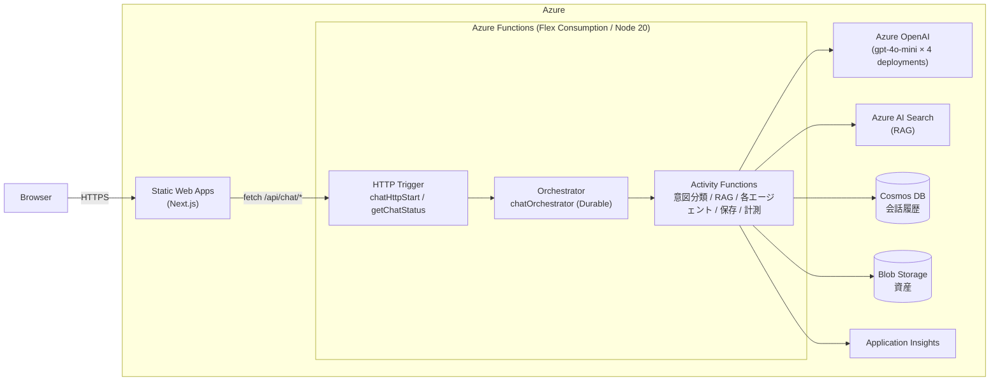
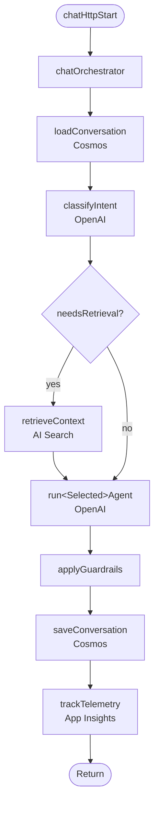
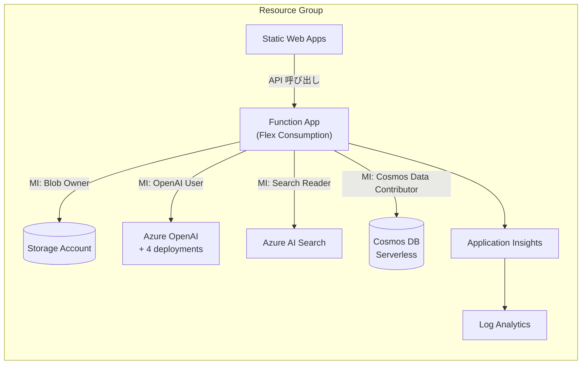

# 基本設計書

防災マルチエージェントチャット PoC のシステム全体構成・モジュール分割・データ設計などの基本設計を示す。

## 1. システム全体構成

### 1.1 構成図



### 1.2 利用 Azure サービス

| 区分 | サービス | 用途 |
| --- | --- | --- |
| ホスティング | Static Web Apps (Free) | Next.js フロントエンド配信 |
| API | Azure Functions Flex Consumption (Linux Node 20) | バックエンド API / オーケストレーション |
| LLM | Azure OpenAI | 意図分類・各エージェント生成 |
| 検索 | Azure AI Search (basic) | RAG 検索 |
| DB | Cosmos DB (Serverless, SQL API) | 会話履歴 |
| ストレージ | Blob Storage | デプロイパッケージ・資産 |
| 監視 | Log Analytics + Application Insights | 計測・ログ集約 |

### 1.3 認証・権限方針

- すべてのデータプレーンで **Local Auth を無効化**
- Function App の **System-Assigned Managed Identity** に必要な RBAC ロールを割り当て
- 開発者個人は `az login` ユーザーに対して必要ロールを付与

## 2. リポジトリ構成

```
poc-disaster-prevention/
├── frontend/      # Next.js (App Router) + TypeScript + Tailwind
├── functions/     # Azure Functions v4 + Durable Functions + TypeScript
├── infra/         # Terraform 一式
├── docs/          # 要件・設計ドキュメント
└── .github/       # Copilot Skills 等
```

## 3. フロントエンド基本設計

### 3.1 画面構成（PoC は単一画面）

- ヘッダー（タイトル・バージョン）
- `AgentSelector`：エージェントモード選択
- `ChatWindow`
  - `MessageList`：会話履歴表示
  - `MessageInput`：入力欄＋送信ボタン
  - `LoadingIndicator` / `ErrorMessage`
- `MapPanel`：地図表示枠（将来拡張）

### 3.2 ディレクトリ

| パス | 役割 |
| --- | --- |
| `frontend/app/` | App Router エントリ |
| `frontend/components/` | 再利用 UI コンポーネント |
| `frontend/lib/api.ts` | バックエンド呼び出し（start / poll status） |
| `frontend/lib/types.ts` | フロントエンド型定義 |
| `frontend/lib/session.ts` | セッション ID 管理 |

### 3.3 API 連携フロー

1. `POST /api/chat/start` → `instanceId` を取得
2. `GET /api/chat/status/{instanceId}` を一定間隔でポーリング
3. ステータスが `Completed` になった時点で `output` を表示

### 3.4 設計上の制約

- Azure サービスを直接呼び出さない（バックエンド経由のみ）
- シークレットを含めない
- API ベース URL は `NEXT_PUBLIC_API_BASE_URL` で注入

## 4. バックエンド基本設計

### 4.1 関数一覧

| 種類 | 名前 | 役割 |
| --- | --- | --- |
| HTTP | `chatHttpStart` | `POST /api/chat/start` |
| HTTP | `getChatStatus` | `GET /api/chat/status/{instanceId}` |
| Orchestrator | `chatOrchestrator` | 全工程の決定論的順序実行 |
| Activity | `loadConversation` | Cosmos から会話履歴取得 |
| Activity | `classifyIntent` | OpenAI で意図分類 |
| Activity | `retrieveContext` | AI Search で RAG |
| Activity | `runFurusatoAgent` | ふるさとエージェント |
| Activity | `runDisasterSimulationAgent` | 防災シミュレーション |
| Activity | `runDisasterLearningAgent` | 防災学習 |
| Activity | `aggregateAnswer` | マルチエージェント結果集約 |
| Activity | `applyGuardrails` | 安全注意付与 |
| Activity | `saveConversation` | Cosmos へ保存 |
| Activity | `trackTelemetry` | App Insights へ送信 |

### 4.2 ディレクトリ

| パス | 役割 |
| --- | --- |
| `functions/src/functions/` | 各 Function の実装 |
| `functions/src/services/` | OpenAI / Search / Cosmos / Blob / AppInsights クライアント |
| `functions/src/prompts/` | 各エージェントのシステムプロンプト |
| `functions/src/shared/` | 環境変数・バリデーション・共通エラー |
| `functions/src/types/` | 共通型定義 |

### 4.3 リクエストフロー（基本）



## 5. データ設計

### 5.1 Cosmos DB

| 項目 | 値 |
| --- | --- |
| API | SQL（Core） |
| Database | `disasterChat`（例） |
| Container | `conversations` |
| Partition Key | `/userId` |

会話ドキュメント（概念）:

```jsonc
{
  "id": "<sessionId>",
  "userId": "<userId>",
  "sessionId": "<sessionId>",
  "turns": [
    { "role": "user" | "assistant", "content": "...", "agent": "...", "timestamp": "ISO8601" }
  ],
  "updatedAt": "ISO8601"
}
```

### 5.2 Azure AI Search

- インデックス：防災・地域 FAQ／参考文書
- フィールド：`title`, `content`, `source`, `url`, `metadata`, ベクトル（任意）
- スコアリング：標準＋セマンティック（必要に応じて）

### 5.3 Blob Storage

| コンテナ | 用途 |
| --- | --- |
| `deploymentpackage` | Functions のランタイムパッケージ |
| `assets` | 参考資料・地図画像等 |

### 5.4 Application Insights

| メトリクス / イベント | 内容 |
| --- | --- |
| Custom Event `ChatCompleted` | sessionId / userId(ハッシュ) / intent / agent / latencyMs |
| Custom Metric `TokenUsageInput` / `TokenUsageOutput` | トークン使用量 |
| Exception | 各 Activity の失敗時に送信 |

## 6. インフラ基本設計

### 6.0 リソース関係図

#### 6.0.1 Azure アーキテクチャ図（公式アイコン付き）

<div align="center">

<table>
  <tr>
    <td align="center" width="180">
      👤<br/><b>User<br/>(Browser)</b>
    </td>
    <td align="center">⟶<br/>HTTPS</td>
    <td align="center" width="180">
      <br/>
      <b>Static Web Apps</b><br/>
      <sub>Next.js (Free SKU)</sub>
    </td>
    <td align="center">⟶<br/>/api/chat/*</td>
    <td align="center" width="180">
      <br/>
      <b>Function App</b><br/>
      <sub>Flex Consumption / Node 20<br/>HTTP + Durable Orchestrator</sub>
    </td>
  </tr>
</table>

<br/>

<table>
  <tr>
    <th colspan="4">⬇️ Function App から Managed Identity (RBAC) で接続</th>
  </tr>
  <tr>
    <td align="center" width="180">
      <br/>
      <b>Azure OpenAI</b><br/>
      <sub>gpt-4o-mini × 4<br/>(intent / furusato /<br/>simulation / learning)</sub>
    </td>
    <td align="center" width="180">
      <br/>
      <b>Azure AI Search</b><br/>
      <sub>basic SKU / RAG</sub>
    </td>
    <td align="center" width="180">
      <br/>
      <b>Azure Cosmos DB</b><br/>
      <sub>Serverless / SQL API<br/>会話履歴 (PK: /userId)</sub>
    </td>
    <td align="center" width="180">
      <br/>
      <b>Storage Account</b><br/>
      <sub>deploymentpackage / assets</sub>
    </td>
  </tr>
</table>

<br/>

<table>
  <tr>
    <th colspan="2">⬇️ 計測 / ログ集約</th>
  </tr>
  <tr>
    <td align="center" width="220">
      <br/>
      <b>Application Insights</b><br/>
      <sub>ChatCompleted / TokenUsage<br/>Latency / Exception</sub>
    </td>
    <td align="center" width="220">
      <br/>
      <b>Log Analytics Workspace</b><br/>
      <sub>App Insights のバックエンド</sub>
    </td>
  </tr>
</table>

</div>

#### 6.0.2 リソース接続トポロジ（Mermaid）



### 6.1 リソース概要

| カテゴリ | リソース |
| --- | --- |
| 基盤 | Resource Group / Log Analytics / Application Insights |
| ストレージ | Storage Account + コンテナ |
| AI | Azure OpenAI + 4 deployments（`intent`, `furusato`, `disaster-simulation`, `disaster-learning`）|
| 検索 | Azure AI Search（Managed Identity） |
| DB | Cosmos DB（Serverless）+ DB + Container |
| API | Azure Functions Flex Consumption |
| Web | Static Web Apps（Free） |

### 6.2 RBAC ロール

| 対象 | スコープ | ロール |
| --- | --- | --- |
| Function MI | Storage | Storage Blob Data Owner / Storage Queue Data Contributor |
| Function MI | OpenAI | Cognitive Services OpenAI User |
| Function MI | AI Search | Search Index Data Reader / Search Service Contributor |
| Function MI | Cosmos | Cosmos DB Built-in Data Contributor |

### 6.3 デプロイ方式

- Terraform で `terraform apply` による一括構築
- フロントエンドは SWA、バックエンドは Functions Flex Consumption へデプロイ
- 出力（`api_base_url` 等）はフロントエンド `.env` に反映

## 7. 例外・エラー設計

| 種別 | 方針 |
| --- | --- |
| 一過性エラー | Activity ごとに `RetryOptions` を設定（OpenAI: 2s × 3 / Search: 1s × 2 / Cosmos: 1s × 3） |
| 入力検証エラー | HTTP 400 を返却。原因コードを `code` フィールドで返す |
| 致命的エラー | 500 を返却し App Insights に Exception 送信 |
| ガードレール違反 | 警告メッセージを `safetyNotes` に追加し継続 |

## 8. 監視・運用

- App Insights ダッシュボードで `ChatCompleted` の件数・平均レイテンシ・失敗率を可視化
- 失敗率がしきい値を超えた場合のアラートは将来追加
- Cosmos / OpenAI のスループット・コストは Azure Cost Management で確認

## 9. セキュリティ設計（基本方針）

- シークレット非ハードコード／環境変数注入
- Local Auth 無効化＋Managed Identity ＋ RBAC
- フロントエンドにキーを露出させない
- 入力・出力に対する Azure OpenAI Content Safety 連携（将来）
- ユーザー入力を直接ログ出力しない（ハッシュ化／要約のみ）
