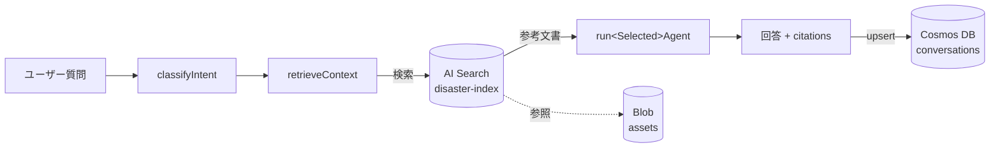

# データ設計書

Cosmos DB / Azure AI Search / Blob Storage のスキーマ詳細。

## 1. Cosmos DB

### 1.1 アカウント / DB / コンテナ

| 項目 | 値 |
| --- | --- |
| API | SQL（Core） |
| アカウント課金 | Serverless |
| Database | `poc-disaster`（既定） |
| Container | `conversations` |
| Partition Key | `/userId` |
| 既定 TTL | なし（PoC）。本番は要件に応じて設定 |

### 1.2 ドキュメント構造

```jsonc
{
  "id": "<sessionId>",                  // ドキュメントキー（sessionId 単位）
  "userId": "<userId>",                  // パーティションキー
  "sessionId": "<sessionId>",
  "createdAt": "2025-01-01T00:00:00Z",
  "updatedAt": "2025-01-01T00:00:00Z",
  "turns": [
    {
      "role": "user",
      "content": "...",
      "timestamp": "2025-01-01T00:00:00Z"
    },
    {
      "role": "assistant",
      "agent": "disaster-learning",
      "content": "...",
      "citations": [
        { "title": "...", "source": "...", "url": "...", "score": 0.83 }
      ],
      "tokenUsage": { "input": 350, "output": 180 },
      "timestamp": "2025-01-01T00:00:05Z"
    }
  ]
}
```

### 1.3 アクセスパターン

| 用途 | 操作 |
| --- | --- |
| 履歴取得 | `read item (id=sessionId, pk=userId)` |
| 保存 | `upsert item`（同 ID で全体置換） |
| 一覧（将来） | `query: SELECT * FROM c WHERE c.userId = @uid` |

### 1.4 整合性 / リトライ

- 既定の整合性レベル（Session）
- `loadConversation` 404 → 空配列で継続
- `saveConversation` upsert はリトライ可（冪等）。並列同 sessionId に対する書き込みは将来 ETag 楽観制御を検討

### 1.5 サイズ / コスト

- ドキュメントは長期化すると 2 MB 上限に近づくため、長期セッションは将来 `turns` を別ドキュメントに分割

## 2. Azure AI Search

### 2.1 インデックス

- 既定インデックス名: `disaster-index`
- SKU: `basic`（`infra/variables.tf: search_sku`）

### 2.2 フィールド定義（推奨）

| フィールド | 型 | 属性 | 用途 |
| --- | --- | --- | --- |
| `id` | `Edm.String` | key, retrievable | ドキュメント ID |
| `title` | `Edm.String` | searchable, retrievable | 表示タイトル |
| `content` | `Edm.String` | searchable, retrievable | 本文 |
| `source` | `Edm.String` | filterable, facetable, retrievable | 出典区分（自治体 / 気象庁 等） |
| `url` | `Edm.String` | retrievable | 参照 URL（公式のみ） |
| `region` | `Edm.String` | filterable, facetable, retrievable | 対象地域コード（任意） |
| `category` | `Edm.String` | filterable, facetable, retrievable | 分類（地震 / 水害 / 学習 等） |
| `metadata` | `Edm.ComplexType` | retrievable | 任意付帯情報 |
| `contentVector` | `Collection(Edm.Single)` | searchable（vectorSearchProfile） | ベクトル検索用（任意） |

### 2.3 検索方針

- `retrieveContext` Activity から `topK=5` で検索
- 必要に応じて Semantic Ranking を有効化
- 結果は `RetrievedDocument` 型に写像し、`citations` の元になる

### 2.4 投入運用

- 元資料は Blob `assets` 配下に配置
- 投入は別途取り込みパイプライン（PoC では手動 or インデクサ）

## 3. Blob Storage

### 3.1 コンテナ構成

| コンテナ | 用途 | 主なアクセス |
| --- | --- | --- |
| `deploymentpackage` | Functions のランタイムパッケージ | Function App MI（読取） |
| `assets` | 参考資料・地図画像・PDF 等 | Function App MI（読取）／管理者（書込） |

### 3.2 命名規則（`assets` 例）

```
assets/
├── manuals/{region}/{topic}.pdf
├── maps/{region}/hazard-{type}.png
└── faq/{topic}.md
```

- 半角英小文字・数字・ハイフン・スラッシュのみ
- 個人情報を含めない
- 公的資料は出典 URL を `metadata` または隣接 `*.json` に記録

## 4. 参照関係



## 5. 関連ドキュメント

- [basic-design.md](./basic-design.md) §5
- [detailed-design.md](./detailed-design.md) §6
- [security-design.md](./security-design.md) §4 データ保護
