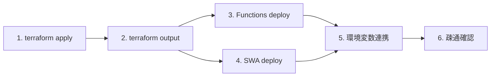

# デプロイ手順

Azure 上に本 PoC をデプロイする手順。

## 1. 全体フロー



## 2. 前提

- Azure サブスクリプションへの **Owner** 相当権限（RBAC 割当のため）
- `az login` 済み
- 対象リージョンで Azure OpenAI が利用可能（既定: `japaneast`）
- [development-setup.md](./development-setup.md) のツールがインストール済

## 3. インフラ構築（Terraform）

```bash
cd infra
cp terraform.tfvars.example terraform.tfvars
# 必要に応じて project / environment / location / openai_location / developer_object_id を編集

terraform init
terraform plan
terraform apply
```

主な入力変数（`infra/variables.tf`）:

| 変数 | 既定値 | 説明 |
| --- | --- | --- |
| `project` | `pocdisaster` | リソース名のプレフィックス |
| `environment` | `dev` | 環境名 |
| `location` | `japaneast` | 主要リージョン |
| `openai_location` | `japaneast` | OpenAI 用リージョン |
| `search_sku` | `basic` | AI Search SKU |
| `developer_object_id` | `null` | 開発者の Entra ID Object ID（任意） |

### 3.1 出力の確認

```bash
terraform output
terraform output -raw api_base_url
terraform output -raw function_app_name
terraform output -raw static_web_app_api_key   # SWA デプロイトークン
```

## 4. Functions のデプロイ

### 4.1 ビルド

```bash
cd functions
npm install
npm run build
```

### 4.2 デプロイ

```bash
FUNC_APP=$(cd ../infra && terraform output -raw function_app_name)
func azure functionapp publish "$FUNC_APP"
```

### 4.3 アプリ設定（環境変数）

Terraform の `function.tf` で多くの設定が自動投入されるが、必要に応じて以下を確認：

```bash
az functionapp config appsettings list -n "$FUNC_APP" -g <resource-group>
```

不足があれば `az functionapp config appsettings set` で追記。

## 5. Frontend (Static Web Apps) のデプロイ

### 5.1 環境変数

ビルド前に `NEXT_PUBLIC_API_BASE_URL` をセット：

```bash
API_BASE=$(cd ../infra && terraform output -raw api_base_url)
echo "NEXT_PUBLIC_API_BASE_URL=$API_BASE" > frontend/.env.production.local
```

### 5.2 ビルド & デプロイ

```bash
cd frontend
npm install
npm run build

SWA_TOKEN=$(cd ../infra && terraform output -raw static_web_app_api_key)
npx @azure/static-web-apps-cli deploy ./out \
  --deployment-token "$SWA_TOKEN" \
  --env production
```

> Next.js を `output: 'export'` で運用しない場合は SWA の Hybrid デプロイ手順を参照。

### 5.3 GitHub Actions による自動化（推奨）

リポジトリに `azure-static-web-apps.yml` を配置し、`AZURE_STATIC_WEB_APPS_API_TOKEN` シークレットに `static_web_app_api_key` を保存することで CI/CD 化できる。

## 6. 疎通確認

```bash
SWA_URL=https://<your-swa>.azurestaticapps.net
curl -X POST "$API_BASE/api/chat/start" \
  -H 'Content-Type: application/json' \
  -d '{"sessionId":"s1","userId":"u1","message":"テスト","agentMode":"auto"}'
```

`instanceId` が返ること、`/api/chat/status/{id}` で `Completed` を確認。
ブラウザから SWA URL を開いてチャットが動作することを確認。

## 7. ロールバック

| 対象 | 方法 |
| --- | --- |
| Functions | `func azure functionapp publish` で前バージョンを再公開、または Deployment Center から戻す |
| SWA | 直前ビルド成果物を再デプロイ |
| インフラ | `terraform apply` で前 commit の状態に戻す（破壊的変更に注意） |

## 8. 破棄

```bash
cd infra
terraform destroy
```

OpenAI のソフトデリート保持期間内は同名リソース再作成に注意（`--purge` の必要あり）。

## 9. 関連ドキュメント

- [development-setup.md](./development-setup.md)
- [security-design.md](./security-design.md)
- [operations-runbook.md](./operations-runbook.md)
