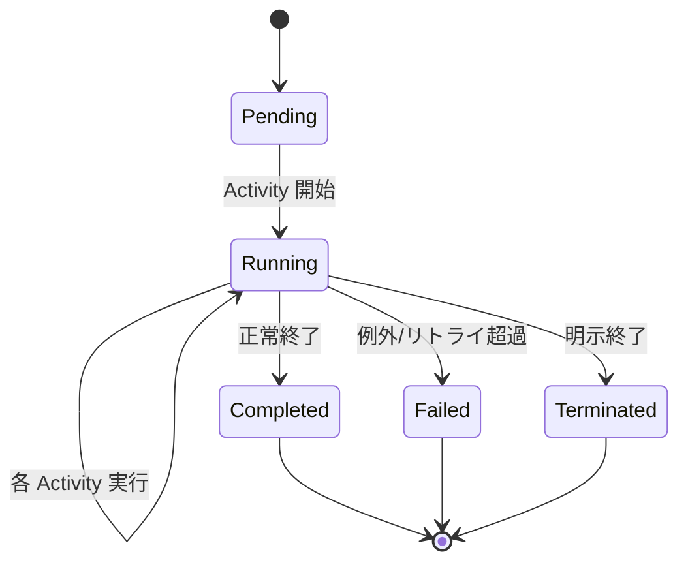

# 詳細設計書

防災マルチエージェントチャット PoC の詳細設計を、API 仕様・型定義・関数別ロジック・データスキーマ・処理シーケンス・例外処理の単位で記述する。

> 関連: [要件定義書](./requirements.md) / [基本設計書](./basic-design.md) / [API 仕様](./api-spec.md) ([openapi.yaml](./api/openapi.yaml)) / [データ設計書](./data-design.md) / [プロンプト設計書](./prompt-design.md) / [セキュリティ設計書](./security-design.md) / [運用 Runbook](./operations-runbook.md) / [テスト方針](./test-plan.md)

## 1. 共通型定義

`functions/src/types/chat.ts` の型を全層で共有する。

```ts
type AgentMode  = "auto" | "furusato" | "disaster-simulation" | "disaster-learning";
type AgentName  = "furusato" | "disaster-simulation" | "disaster-learning" | "multi-agent";
type Confidence = "low" | "medium" | "high";

interface ChatRequest {
  sessionId: string;
  userId: string;
  message: string;
  agentMode: AgentMode;
}

interface Citation       { title?: string; source?: string; url?: string; score?: number; }
interface TokenUsage     { input: number; output: number; }
interface ConversationTurn { role: "user"|"assistant"|"system"; content: string; agent?: AgentName; timestamp: string; }
interface RetrievedDocument { title: string; content: string; source: string; url?: string; score: number; metadata?: Record<string, unknown>; }

interface IntentResult { intent: string; agent: AgentName; needsRetrieval: boolean; confidence: Confidence; }
interface AgentInput   { message: string; history: ConversationTurn[]; documents: RetrievedDocument[]; intent: string; }
interface AgentOutput  { agent: AgentName; answer: string; citations: Citation[]; confidence: Confidence; safetyNotes: string[]; tokenUsage: TokenUsage; }

interface OrchestratorInput  { request: ChatRequest; startedAtMs: number; }
interface OrchestratorOutput {
  answer: string;
  agent: AgentName;
  citations: Citation[];
  metadata: { intent: string; latencyMs: number; tokenUsage: TokenUsage; };
}
```

## 2. HTTP API 仕様

> 正準定義は [api/openapi.yaml](./api/openapi.yaml)、要約は [api-spec.md](./api-spec.md) を参照。本章はサマリ。


### 2.1 `POST /api/chat/start`

| 項目 | 内容 |
| --- | --- |
| 説明 | Durable Functions のオーケストレーションを起動 |
| 認証 | なし（PoC） |
| リクエスト | `application/json` |

リクエスト Body:

```json
{
  "sessionId": "string",
  "userId": "string",
  "message": "string",
  "agentMode": "auto | furusato | disaster-simulation | disaster-learning"
}
```

レスポンス（202 Accepted）:

```json
{
  "instanceId": "string",
  "statusQueryGetUri": "https://.../api/chat/status/{instanceId}"
}
```

### 2.2 `GET /api/chat/status/{instanceId}`

| 項目 | 内容 |
| --- | --- |
| 説明 | オーケストレーションのステータスと結果を取得 |

レスポンス（200 OK）:

```json
{
  "runtimeStatus": "Pending | Running | Completed | Failed | Terminated",
  "output": {
    "answer": "string",
    "agent": "AgentName",
    "citations": [ { "title": "...", "source": "...", "url": "...", "score": 0.0 } ],
    "metadata": { "intent": "string", "latencyMs": 0, "tokenUsage": { "input": 0, "output": 0 } }
  },
  "createdTime": "ISO8601",
  "lastUpdatedTime": "ISO8601"
}
```

### 2.3 エラー応答

```json
{ "code": "INVALID_REQUEST", "message": "agentMode is required" }
```

主なコード：`INVALID_REQUEST` / `UPSTREAM_ERROR` / `INTERNAL_ERROR`

## 3. オーケストレータ詳細

`chatOrchestrator`（決定論的）。Activity 呼び出しは `callActivityWithRetry` を利用。

### 3.1 リトライ設定

| サービス | 初期遅延 | 最大試行 |
| --- | --- | --- |
| OpenAI | 2 秒 | 3 |
| AI Search | 1 秒 | 2 |
| Cosmos DB | 1 秒 | 3 |

### 3.2 シーケンス（疑似コード）

```ts
function* chatOrchestrator(ctx) {
  const { request, startedAtMs } = ctx.df.getInput<OrchestratorInput>();

  const history = yield ctx.df.callActivityWithRetry("loadConversation", cosmosRetry,
    { sessionId: request.sessionId, userId: request.userId });

  const intent  = yield ctx.df.callActivityWithRetry("classifyIntent", openAiRetry,
    { message: request.message, history });

  const documents = intent.needsRetrieval
    ? yield ctx.df.callActivityWithRetry("retrieveContext", searchRetry,
        { query: request.message, intent: intent.intent, topK: 5 })
    : [];

  const selectedAgent = selectAgent(request, intent);
  const agentOutput   = yield ctx.df.callActivityWithRetry(
    AGENT_ACTIVITY[selectedAgent], openAiRetry,
    { message: request.message, history, documents, intent: intent.intent });

  const guarded = yield ctx.df.callActivity("applyGuardrails", { output: agentOutput });

  yield ctx.df.callActivityWithRetry("saveConversation", cosmosRetry,
    { sessionId, userId, userMessage: request.message, assistantOutput: guarded,
      timestamp: ctx.df.currentUtcDateTime.toISOString() });

  const latencyMs = Math.max(0, ctx.df.currentUtcDateTime.getTime() - startedAtMs);

  yield ctx.df.callActivity("trackTelemetry",
    { sessionId, userId, intent: intent.intent, agent: guarded.agent, latencyMs,
      tokenUsage: guarded.tokenUsage, instanceId: ctx.df.instanceId });

  return {
    answer: guarded.answer, agent: guarded.agent, citations: guarded.citations,
    metadata: { intent: intent.intent, latencyMs, tokenUsage: guarded.tokenUsage }
  };
}
```

### 3.3 エージェント選択ルール

```ts
function selectAgent(request, intent) {
  if (request.agentMode !== "auto") return request.agentMode;
  if (intent.agent === "multi-agent") return "disaster-learning"; // PoC は集約代替
  return intent.agent;
}
```

### 3.4 決定論性

- 現在時刻は `ctx.df.currentUtcDateTime` を使用
- 乱数 / `Date.now()` / `fetch` を直接利用しない
- 開始時刻は `OrchestratorInput.startedAtMs` として呼び出し側から渡す

### 3.5 エージェント選択フロー

```mermaid
flowchart TB
  In([request, intent])
  Mode{request.agentMode == "auto"?}
  Manual[selected = request.agentMode]
  Multi{intent.agent == "multi-agent"?}
  Fallback["selected = 'disaster-learning'<br/>(PoC 集約代替)"]
  Use[selected = intent.agent]
  Out([selectedAgent])
  In --> Mode
  Mode -- no --> Manual --> Out
  Mode -- yes --> Multi
  Multi -- yes --> Fallback --> Out
  Multi -- no --> Use --> Out
```

## 4. Activity 詳細

### 4.1 loadConversation

- 入力：`{ sessionId, userId }`
- 出力：`ConversationTurn[]`
- 処理：Cosmos `conversations` コンテナから `id = sessionId, partitionKey = userId` で取得
- 失敗時：404 は空配列を返却。それ以外は throw

### 4.2 classifyIntent

- 入力：`{ message, history }`
- 出力：`IntentResult`
- LLM：`intent` deployment（gpt-4o-mini）
- プロンプト：`prompts/intentClassifier.ts`
- 出力 JSON 強制（JSON モード or 出力スキーマ説明）。パース失敗時はデフォルト `{ intent:"general", agent:"disaster-learning", needsRetrieval:false, confidence:"low" }` を返却

### 4.3 retrieveContext

- 入力：`{ query, intent, topK }`
- 出力：`RetrievedDocument[]`
- 処理：AI Search `search` 呼び出し（必要に応じてセマンティック）。`title/content/source/url/score` を抽出
- 結果が空の場合は空配列

### 4.4 runFurusatoAgent / runDisasterSimulationAgent / runDisasterLearningAgent

- 入力：`AgentInput`
- 出力：`AgentOutput`
- LLM：各 deployment（`furusato` / `disaster-simulation` / `disaster-learning`）
- プロンプト：`prompts/{furusato|disasterSimulation|disasterLearning}.ts`
- `documents` を context として system / user メッセージに付与
- `tokenUsage` は OpenAI レスポンス `usage.prompt_tokens` / `usage.completion_tokens` を使用
- `citations` は `documents` から `title/source/url/score` を写像

### 4.5 aggregateAnswer

- 複数エージェント結果を 1 つの `AgentOutput` に統合（PoC では将来拡張用に枠だけ用意）

### 4.6 applyGuardrails

- 入力：`{ output: AgentOutput }`
- 出力：`AgentOutput`
- 処理：
  - 災害関連キーワードを検出した場合、`safetyNotes` に「最新の公式情報（気象庁・自治体）を必ず確認してください」を追加
  - `answer` 末尾に注意文を追記
  - 引用に AI Search 由来でない URL があれば除去（捏造防止）

### 4.7 saveConversation

- 入力：`{ sessionId, userId, userMessage, assistantOutput, timestamp }`
- 処理：既存ドキュメントを取得→`turns` に user / assistant を追記→`upsert`
- `id = sessionId`, `partitionKey = userId`
- 冪等：同 timestamp の重複追加をしない

### 4.8 trackTelemetry

- Application Insights `TelemetryClient` で以下を送信
  - Custom Event `ChatCompleted`：`{ sessionId, userIdHash, intent, agent, instanceId }`
  - Custom Metric：`latencyMs`, `tokenUsage.input`, `tokenUsage.output`
- ユーザー入力本文は送信しない

## 5. プロンプト方針

> 詳細は [prompt-design.md](./prompt-design.md) を参照。本章は要点のみ。


### 5.1 共通方針

- 出力はマークダウン
- 不確実な場合は推測せず「不明」と回答
- 引用は `documents` の範囲のみ
- 災害関連は最新情報の確認を促す

### 5.2 意図分類（`intentClassifier`）

- 入力：直近のメッセージ + 履歴の要約
- 出力：JSON のみ
  - `intent`: 短い英語ラベル
  - `agent`: `furusato | disaster-simulation | disaster-learning | multi-agent`
  - `needsRetrieval`: boolean
  - `confidence`: `low|medium|high`

### 5.3 各エージェント

- Furusato：地域固有の防災・行政情報、移住者視点を加味
- Disaster Simulation：シナリオベースの被害想定／避難手順／持ち物
- Disaster Learning：基礎知識・FAQ・教育目的

## 6. データスキーマ詳細

> 詳細は [data-design.md](./data-design.md) を参照。本章はサマリ。


### 6.1 Cosmos `conversations`

```jsonc
{
  "id": "<sessionId>",
  "userId": "<userId>",
  "sessionId": "<sessionId>",
  "createdAt": "2025-01-01T00:00:00Z",
  "updatedAt": "2025-01-01T00:00:00Z",
  "turns": [
    {
      "role": "user",
      "content": "...",
      "timestamp": "2025-01-01T00:00:00Z"
    },
    {
      "role": "assistant",
      "agent": "disaster-learning",
      "content": "...",
      "citations": [{ "title": "...", "source": "...", "url": "...", "score": 0.83 }],
      "tokenUsage": { "input": 350, "output": 180 },
      "timestamp": "2025-01-01T00:00:05Z"
    }
  ]
}
```

### 6.2 AI Search インデックス（例）

| フィールド | 型 | 属性 |
| --- | --- | --- |
| `id` | string | key |
| `title` | string | searchable, retrievable |
| `content` | string | searchable, retrievable |
| `source` | string | filterable, retrievable |
| `url` | string | retrievable |
| `metadata` | complex | retrievable |
| `contentVector` | Collection(Edm.Single) | searchable（任意） |

## 7. フロントエンド詳細

### 7.1 主要コンポーネント

| コンポーネント | 役割 |
| --- | --- |
| `ChatWindow` | 状態管理（メッセージ・ローディング・エラー）、ポーリング制御 |
| `MessageList` | 配列レンダリング、エージェントバッジ・引用表示 |
| `MessageInput` | テキスト入力、Enter で送信、IME 対応 |
| `AgentSelector` | 4 モードの単一選択 |
| `LoadingIndicator` | スピナー＋経過秒数 |
| `ErrorMessage` | エラーコード／メッセージ表示 |
| `MapPanel` | 地図枠（将来） |

### 7.2 API クライアント（`lib/api.ts`）

```ts
export async function startChat(req: ChatRequest): Promise<{ instanceId: string; statusQueryGetUri: string }>;
export async function pollStatus(instanceId: string, signal?: AbortSignal): Promise<StatusResponse>;
```

- `startChat` は `NEXT_PUBLIC_API_BASE_URL + "/api/chat/start"` を呼び出し
- `pollStatus` は 1〜2 秒間隔、最大 60 秒のバックオフ。`Completed` / `Failed` / `Terminated` で終了

### 7.3 セッション管理（`lib/session.ts`）

- `localStorage` に `sessionId` / `userId` を保存
- 未存在なら `crypto.randomUUID()` で生成

### 7.4 エラーハンドリング

- ネットワーク失敗 → 自動リトライ 1 回 → ユーザー通知
- バックエンド 4xx → メッセージをそのまま表示
- 5xx → 共通文言＋再試行ボタン

## 8. シーケンス図

```mermaid
sequenceDiagram
  autonumber
  actor User as User
  participant UI as Frontend (Next.js)
  participant FN as Functions (HTTP)
  participant DF as Durable Orchestrator
  participant COS as Cosmos DB
  participant OAI as Azure OpenAI
  participant SRCH as AI Search
  participant AI as App Insights

  User->>UI: メッセージ送信
  UI->>FN: POST /api/chat/start
  FN->>DF: orchestration 開始
  FN-->>UI: 202 { instanceId }
  loop polling
    UI->>FN: GET /api/chat/status/{id}
    FN-->>UI: runtimeStatus
  end
  DF->>COS: loadConversation
  DF->>OAI: classifyIntent
  alt intent.needsRetrieval
    DF->>SRCH: retrieveContext
  end
  DF->>OAI: run&lt;Selected&gt;Agent
  DF->>DF: applyGuardrails
  DF->>COS: saveConversation (upsert)
  DF->>AI: trackTelemetry
  DF-->>FN: OrchestratorOutput
  FN-->>UI: 200 { answer, agent, citations, metadata }
  UI-->>User: 回答 + 引用 + エージェント表示
```

### 8.1 オーケストレーション状態遷移



## 9. 例外処理詳細

| 発生箇所 | ハンドリング |
| --- | --- |
| OpenAI 429 / 5xx | リトライ（指数バックオフ）。3 回失敗で `UPSTREAM_ERROR` |
| AI Search 失敗 | 検索結果ゼロとして継続（`documents=[]`） |
| Cosmos 404 (履歴なし) | 空履歴で継続 |
| Cosmos 競合 (412) | 1 回再取得→マージ→再 upsert |
| App Insights 送信失敗 | warn ログのみ。回答処理に影響させない |
| 意図分類 JSON パース失敗 | デフォルト `IntentResult` で継続 |
| Guardrails 例外 | 元出力をそのまま返し warn ログ |

## 10. 環境変数

| 変数名 | 用途 |
| --- | --- |
| `AZURE_OPENAI_ENDPOINT` | OpenAI エンドポイント |
| `AZURE_OPENAI_DEPLOYMENT_INTENT` | 意図分類用 deployment 名 |
| `AZURE_OPENAI_DEPLOYMENT_FURUSATO` | ふるさと用 |
| `AZURE_OPENAI_DEPLOYMENT_SIMULATION` | シミュレーション用 |
| `AZURE_OPENAI_DEPLOYMENT_LEARNING` | 学習用 |
| `AZURE_SEARCH_ENDPOINT` / `AZURE_SEARCH_INDEX` | AI Search |
| `COSMOS_ENDPOINT` / `COSMOS_DATABASE` / `COSMOS_CONTAINER` | Cosmos DB |
| `BLOB_ACCOUNT_URL` / `BLOB_CONTAINER_ASSETS` | Blob Storage |
| `APPLICATIONINSIGHTS_CONNECTION_STRING` | App Insights |
| `NEXT_PUBLIC_API_BASE_URL` | フロントエンド側で参照 |

API キーはローカル開発時のみ任意で設定可。実環境は `DefaultAzureCredential` を使用。

## 11. テスト方針（PoC）

> 詳細は [test-plan.md](./test-plan.md) を参照。本章は概要。


| レイヤ | 内容 |
| --- | --- |
| ユニット | `selectAgent` / `applyGuardrails` / 意図分類パース |
| 結合 | `chatOrchestrator` を Durable Functions ローカル実行で確認 |
| E2E | フロント→Functions→Azure サービスを手動実行で確認 |
| 性能 | 単発リクエストでレイテンシ計測（App Insights） |

## 12. デプロイ手順（概要）

> 完全手順は [deployment.md](./deployment.md)、ローカル開発は [development-setup.md](./development-setup.md) を参照。


1. `infra/` で `terraform init && terraform apply`
2. `terraform output` から `api_base_url` / `function_app_name` / `static_web_app_api_key` を取得
3. `functions/` を Azure Functions にデプロイ（`func azure functionapp publish`）
4. `frontend/` を Static Web Apps にデプロイ（`swa deploy` または GitHub Actions）
5. SWA の環境変数に `NEXT_PUBLIC_API_BASE_URL` を設定
6. ブラウザから疎通確認
