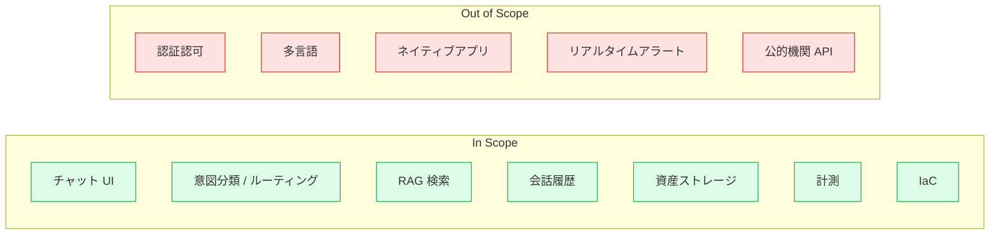
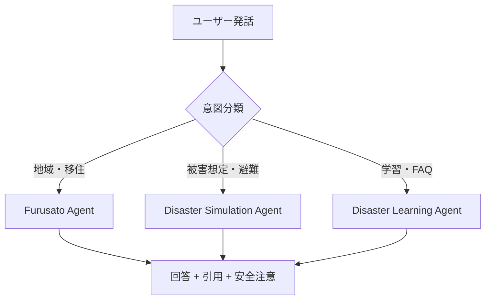

# 要件定義書

防災マルチエージェントチャット PoC（以下、本アプリ）の要件を定義する。

> 関連: [基本設計書](./basic-design.md) / [詳細設計書](./detailed-design.md) / [docs/README](./README.md)

## 1. 背景と目的

近年、自然災害の頻発化・激甚化に伴い、住民が「平時の学習」「事前のシミュレーション」「自治体（ふるさと）固有の情報取得」を一気通貫で行える対話型サービスのニーズが高まっている。本 PoC は、複数の専門エージェントを Azure OpenAI Service と Azure AI Search 上で連携させ、ユーザーの意図に応じて適切なエージェントが回答するチャット UX を検証することを目的とする。

## 2. スコープ

### 2.1 対象範囲（In Scope）

- ブラウザ上で動作する単一ページのチャット UI
- ユーザー意図の自動分類と専門エージェントへのルーティング
- RAG（Azure AI Search）による参考情報の取得と引用提示
- 会話履歴の永続化（Cosmos DB）
- 参考資料・地図素材等の格納（Blob Storage）
- 利用状況・トークン消費量・レイテンシの計測（Application Insights）
- Azure 上での IaC によるインフラ構築（Terraform）

### 2.2 対象外（Out of Scope）

- 認証・認可基盤（PoC では `userId` をクライアント生成）
- 多言語対応（日本語のみ）
- ネイティブモバイルアプリ
- リアルタイム災害アラート配信
- 公的機関 API との連携（将来検討）

### 2.3 スコープ俯瞰図

## 3. ユーザーとペルソナ

| ペルソナ | 説明 | 主な利用目的 |
| --- | --- | --- |
| 一般住民 | 防災に関心のある居住者 | 平時学習・避難計画策定 |
| 自治体担当者 | 防災部門の職員 | 住民向け情報のシミュレーション |
| 移住検討者 | ふるさと地域を調べる利用者 | 地域固有の災害特性把握 |

## 4. 機能要件

### 4.1 チャット機能

| ID | 要件 |
| --- | --- |
| FR-01 | ユーザーは自由文でメッセージを送信できる |
| FR-02 | UI 上で `auto` / `furusato` / `disaster-simulation` / `disaster-learning` のエージェントモードを選択できる |
| FR-03 | `auto` モードでは意図分類結果に基づき適切なエージェントを選択する |
| FR-04 | 応答は逐次ポーリングで取得し、完了時に最終回答・選択エージェント・引用元を表示する |
| FR-05 | 引用元（Citations）として AI Search の参照ドキュメントを表示する |
| FR-06 | 災害関連の回答には公式情報の参照を促す注意文を自動付与する（ガードレール） |
| FR-07 | セッション ID 単位で会話履歴を保持し、後続応答の文脈に利用する |

### 4.2 エージェント

| エージェント | 役割 |
| --- | --- |
| Furusato Agent | 自治体・地域固有の防災・暮らし情報を回答 |
| Disaster Simulation Agent | 災害発生時の被害想定・避難行動シミュレーション |
| Disaster Learning Agent | 平時の防災学習・知識提供 |

### 4.3 バックエンド機能

| ID | 要件 |
| --- | --- |
| FR-10 | Durable Functions のオーケストレーションでマルチステップ処理を行う |
| FR-11 | 外部サービス呼び出し（OpenAI / AI Search / Cosmos / Blob）はすべて Activity 関数経由 |
| FR-12 | Cosmos DB に会話履歴を upsert で保存する（冪等） |
| FR-13 | Application Insights に意図・エージェント・レイテンシ・トークン使用量を送信 |
| FR-14 | HTTP `POST /api/chat/start` で起動、`GET /api/chat/status/{instanceId}` でステータス取得 |

## 5. 非機能要件

| 区分 | 要件 |
| --- | --- |
| 性能 | 通常応答 10 秒以内（PoC 目標） |
| 可用性 | Azure 既定 SLA に準拠（PoC は単一リージョン） |
| 拡張性 | エージェント追加が Activity 関数追加とプロンプト追加のみで可能 |
| 保守性 | TypeScript + 関数分離による責務明確化 |
| セキュリティ | シークレットはコードに埋め込まない／環境変数経由／Local Auth 無効化 + Managed Identity + RBAC |
| 監視 | Application Insights で計測。エラー・遅延を可視化 |
| コスト | Cosmos DB Serverless / Functions Flex Consumption / SWA Free SKU を採用 |
| プライバシー | ユーザー入力をログに直接出力しない |

## 6. 制約

- フロントエンドから Azure OpenAI / AI Search / Cosmos DB / Blob を直接呼び出さない（必ず Functions API 経由）
- オーケストレータは決定論的に保つ（HTTP / 乱数 / 現在時刻直接利用禁止）
- AI Search 由来でない引用は捏造しない
- 災害関連回答には安全注意を必ず付与
- シークレットを GitHub にコミットしない

## 7. 前提

- Azure サブスクリプションが利用可能であること
- Azure OpenAI のクォータが対象リージョンで確保できること
- 開発者は `az login` 済みで Managed Identity / RBAC 経由でアクセスできること

## 8. 用語

主要用語のみ抜粋。完全な一覧は [glossary.md](./glossary.md) を参照。

| 用語 | 説明 |
| --- | --- |
| エージェント | 特定領域に特化した LLM プロンプト＋実行ロジックの単位 |
| 意図分類 | ユーザー発話から最適エージェント・RAG 要否を判定する処理 |
| RAG | Retrieval-Augmented Generation。AI Search による参考文書検索を回答生成に活用 |
| ガードレール | 出力に安全注意・公式情報参照を付与する後処理 |

## 9. 受入基準（PoC ゴール）

- ブラウザから自由文を投稿し、エージェントに応じた回答と引用が表示できる
- `auto` 選択時に意図に応じてエージェントが切り替わる
- Cosmos DB に会話が保存され、再質問時に文脈が考慮される
- Application Insights にトークン消費・レイテンシが記録される
- Terraform 一発で Azure 上に再構築可能であること
