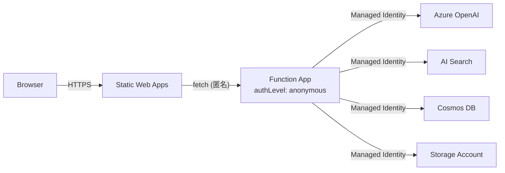

# セキュリティ設計書

防災マルチエージェントチャット PoC のセキュリティ方針・実装。

## 1. 基本方針

- **Local Auth 無効化**：データプレーンへのキー / 接続文字列認証を全サービスで停止
- **Managed Identity + RBAC**：Function App の System-Assigned MI に最小権限ロールを付与
- **シークレット非埋め込み**：環境変数経由のみ。コード・リポジトリに書かない
- **直接呼び出し禁止**：フロントエンドから Azure データプレーンを直接呼ばない（必ず Functions 経由）
- **入力ログ抑制**：ユーザー入力本文を生のままログ・テレメトリに出さない

## 2. 認証・認可

### 2.1 認証境界

- フロント→Functions は **匿名**（PoC のため）。本番化時は Entra ID 認証 / SWA Auth / API Management の前段配置を推奨
- Functions→Azure データサービスはすべて **MI + RBAC**

### 2.2 RBAC ロール一覧

| プリンシパル | スコープ | ロール |
| --- | --- | --- |
| Function App MI | Storage Account | Storage Blob Data Owner / Storage Queue Data Contributor |
| Function App MI | Azure OpenAI | Cognitive Services OpenAI User |
| Function App MI | AI Search | Search Index Data Reader / Search Service Contributor |
| Function App MI | Cosmos DB | Cosmos DB Built-in Data Contributor |
| 開発者 (`developer_object_id`) | OpenAI / Storage / Cosmos | 同等の Data Contributor 系（任意） |

定義は `infra/rbac.tf`。

### 2.3 Local Auth 無効化

- Azure OpenAI: `local_auth_enabled = false`
- Azure AI Search: `local_authentication_enabled = false`
- Cosmos DB: `local_authentication_disabled = true`
- AzureWebJobsStorage: `AzureWebJobsStorage__accountName` で Identity ベース化

## 3. シークレット管理

| 種類 | 管理方法 |
| --- | --- |
| OpenAI / Search / Cosmos キー | **使わない**（Local Auth 無効化）。`local.settings.json.example` のキー欄は空 |
| App Insights 接続文字列 | Function App の Application Settings に格納 |
| SWA デプロイトークン | Terraform 出力 → GitHub Actions Secrets |
| Terraform tfvars | `terraform.tfvars` は `.gitignore` 対象。`example` のみコミット |

将来検討：Azure Key Vault + Key Vault references による集中管理。

## 4. データ保護

| データ | 保管 | 暗号化 | 保管期間 |
| --- | --- | --- | --- |
| 会話履歴 | Cosmos DB `conversations` | 既定で保管時暗号化 | 無期限（PoC）。本番化時は TTL / 削除ポリシー検討 |
| 参考資料 | Blob `assets` | 既定で保管時暗号化 | 任意 |
| ログ・テレメトリ | Log Analytics | Microsoft 管理鍵 | デフォルト保持 30 日 |

転送中は HTTPS / TLS 強制。

## 5. 入力 / 出力の安全策

| 観点 | 対策 |
| --- | --- |
| 入力検証 | `validateChatRequest` で必須項目・型・許容値を検査 |
| 入力ログ抑制 | `userId` はハッシュ化、`message` 本文は出力しない（Custom Event の `customDimensions` に含めない） |
| 引用の捏造防止 | `applyGuardrails` で AI Search 由来でない URL を除去 |
| 安全注意付与 | 災害関連キーワード検出時に `safetyNotes` と本文末尾に注意文を追加 |
| Prompt Injection 抑止 | システムプロンプトでロールを固定。ユーザー文字列を直接 system に流入させない |
| Content Safety（将来） | Azure AI Content Safety 連携で有害出力をフィルタ |

## 6. 想定脅威と対策（簡易）

| 脅威 | 対策 |
| --- | --- |
| 不正アクセス（API 直叩き） | 本番は Entra ID 認証を前段に必須化 |
| クォータ枯渇 / コスト爆増 | OpenAI TPM 上限、Functions 同時実行制限、課金アラート |
| 個人情報の混入 | UI で「個人情報を入力しない」旨を表示。ログ抑制で残存リスクを低減 |
| プロンプト経由の機密漏えい | システムプロンプトに機密を入れない。citations のみ AI Search 由来 |
| 依存ライブラリ脆弱性 | `npm audit` を CI 化（推奨） |
| Terraform State の漏えい | リモートバックエンド（Azure Storage + RBAC）への移行を推奨 |

## 7. 開発・運用上のルール

- 秘密情報を Issue / PR / コミットメッセージに貼らない
- `local.settings.json` はコミット禁止（`.gitignore` 済）
- ログレベルは本番 `Information` 以下で運用、`Debug` は時限利用
- ユーザー入力をデバッグログに直接出力しない（要約 / 件数のみ）

## 8. 関連ドキュメント

- [basic-design.md](./basic-design.md) §9
- [operations-runbook.md](./operations-runbook.md)
- [data-design.md](./data-design.md)
