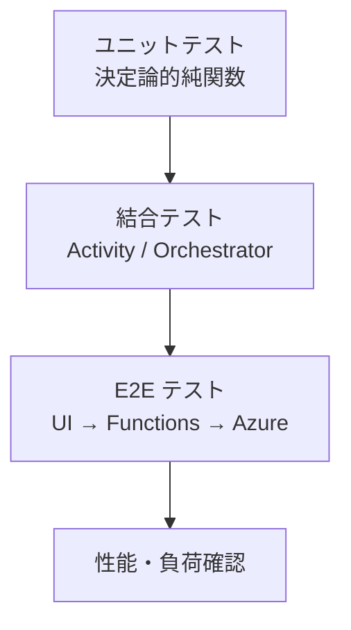

# テスト方針

防災マルチエージェントチャット PoC のテスト戦略・観点・確認項目。

## 1. 方針

- PoC のため、自動テストは**重要ロジック**に絞る（網羅率より価値）
- LLM 応答は非決定的なため、**入出力スキーマ / 制約**をテスト対象とし、**文面**は対象外
- 外部サービス呼び出しはモック化し、Activity 単位で隔離テスト
- Durable Functions の Orchestrator は決定論性を確認

## 2. テストレベル

## 3. ユニットテスト

| 対象 | 観点 |
| --- | --- |
| `selectAgent` (orchestrator 内) | `agentMode=auto`/手動/`multi-agent` フォールバック |
| `applyGuardrails` | 災害キーワード検出、安全注意付与、AI Search 由来でない引用の除去 |
| `validateChatRequest` | 必須/型/長さ、不正 JSON、未許可 `agentMode` |
| 意図分類 JSON パーサ | パース失敗時のデフォルト値返却 |
| `errors.safeErrorMessage` | エラー型ごとに安全な文字列化 |
| トークン使用量集計 | OpenAI レスポンス `usage` の写像 |

実装：`vitest` または `jest` を `functions/` に追加（PoC では未導入の場合は手動確認可）

## 4. 結合テスト

### 4.1 Activity 単体

外部 SDK をモック（`AzureKeyCredential`、`OpenAIClient` 等）：

| Activity | 検証 |
| --- | --- |
| `loadConversation` | 404 → `[]`、正常時の `turns` マッピング |
| `classifyIntent` | OpenAI モックを与え、`IntentResult` 形式で返ること |
| `retrieveContext` | Search モックの結果を `RetrievedDocument[]` に変換 |
| `runFurusatoAgent` 等 | プロンプト合成と `tokenUsage` の写像 |
| `saveConversation` | upsert 呼び出し回数 / 入力ペイロード |
| `trackTelemetry` | カスタムイベント / メトリクス送信内容 |

### 4.2 Orchestrator

Durable Functions のローカル実行（`func start`）+ HTTP 叩き：

- `agentMode` ごとに正しい Activity が選ばれる
- `intent.needsRetrieval` が `false` の場合に `retrieveContext` が呼ばれない
- リトライ設定（OpenAI 3 / Search 2 / Cosmos 3）が機能する

## 5. E2E テスト

ローカル or デプロイ後の Azure 環境に対して：

| シナリオ | 期待 |
| --- | --- |
| `auto` で「○○市の避難所は？」 | Furusato 系の回答＋引用 |
| `auto` で「地震の備えを教えて」 | Disaster Learning 系の回答 |
| 連続会話（同 sessionId） | 直前の文脈を踏まえた回答 |
| 手動エージェント切替 | 選択したエージェントで回答 |
| 不正リクエスト | 400 + エラーメッセージ |
| OpenAI 障害（疑似） | リトライ後、適切なエラー UI |

## 6. 非機能・性能観点

| 観点 | 確認方法 |
| --- | --- |
| レイテンシ | App Insights `latencyMs` が単発で 10 秒以内 |
| トークン消費 | `tokenUsage` が想定範囲内 |
| 同時実行 | 軽負荷（5 並列）で成功率 100% |
| 失敗率 | App Insights Exception が想定外パターンを出していない |

## 7. PoC 受入確認チェックリスト

- [ ] ブラウザから自由文を投稿し、エージェントに応じた回答と引用が表示される
- [ ] `auto` 選択時に意図に応じてエージェントが切り替わる
- [ ] Cosmos DB に会話が保存され、再質問時に文脈が考慮される
- [ ] Application Insights にトークン消費・レイテンシが記録される
- [ ] Terraform で Azure 上に再構築できる
- [ ] フロントエンドから Azure サービスを直接呼び出していない（Functions 経由のみ）
- [ ] シークレットがソースに含まれない / Local Auth が無効

## 8. 関連ドキュメント

- [detailed-design.md](./detailed-design.md) — テスト対象ロジックの詳細
- [operations-runbook.md](./operations-runbook.md) — 障害時の確認手順
